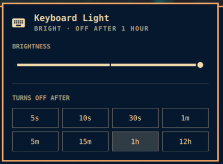

# omakeylight

An [Omarchy](https://omarchy.org/) bar widget for your keyboard backlight:
set the **brightness** and the **delay before it switches itself off**, without
digging through `/sys` or reaching for `sudo`.



## What it does

- A keyboard glyph in the bar, dimmed when the backlight is off.
- **Left-click** opens a panel with a brightness slider and the auto-off delays
  the driver accepts.
- **Right-click** toggles the light, restoring the last level you used.
- **Scroll** over the icon steps the brightness up and down.
- Hides itself entirely on machines with no keyboard backlight.

## Requirements

- Omarchy with `omarchy-shell` (the Quickshell bar).
- A keyboard-backlight LED under `/sys/class/leds` — the widget matches
  `*kbd_backlight`, so `dell::`, `tpacpi::`, `asus::`, `smc::` and friends all work.
- `brightnessctl` (ships with Omarchy) for the brightness half.

The **delay** half needs a driver that exposes `stop_timeout`. In practice that
means Dell laptops; on other hardware the widget shows brightness only and says
so in the panel.

## Install

```bash
omarchy plugin add https://github.com/OEM-Mrks/omakeylight.git
~/.config/omarchy/plugins/omakeylight.keylight/install.sh
omarchy plugin enable omakeylight.keylight --section right
```

`install.sh` needs root once, for a udev rule — see below. Brightness works
without it.

## Why the installer wants root once

Brightness is not the problem: `brightnessctl` reaches it through
systemd-logind, which grants the active session write access to LED brightness.
No root, no setuid.

`stop_timeout` has no such path. It is a driver-specific sysfs attribute owned
by `root:root`, so changing it normally means `sudo` every time. The installer
drops one udev rule:

```
ACTION=="add|change", SUBSYSTEM=="leds", KERNEL=="*kbd_backlight", \
  TEST=="stop_timeout", \
  RUN+="/usr/bin/chgrp wheel /sys/class/leds/%k/stop_timeout", \
  RUN+="/usr/bin/chmod 0664 /sys/class/leds/%k/stop_timeout"
```

That hands the `wheel` group write access to **that one attribute** and nothing
else — not brightness, not triggers, not any other LED. Edit the group in
`udev/99-omakeylight.rules` before installing if `wheel` is not what you want.

To undo it:

```bash
sudo rm /etc/udev/rules.d/99-omakeylight.rules
sudo udevadm control --reload-rules
```

## CLI

`install.sh` links `omakeylight-ctl` into `~/.local/bin`, which is handy for
keybindings:

```bash
omakeylight-ctl status          # tab-separated key/value lines
omakeylight-ctl brightness 1    # absolute level
omakeylight-ctl brightness +1   # relative, also -1 / off / max
omakeylight-ctl toggle          # off, or back to the last level used
omakeylight-ctl timeout 30s     # auto-off delay
omakeylight-ctl timeouts        # delays this driver accepts
omakeylight-ctl probe           # re-detect them and refresh the cache
```

Bind it in `~/.config/hypr/bindings.lua`, for example to the keyboard-backlight key:

```lua
o.bind("", "XF86KbdBrightnessUp",   "exec", "omakeylight-ctl brightness +1")
o.bind("", "XF86KbdBrightnessDown", "exec", "omakeylight-ctl brightness -1")
```

The widget also answers shell IPC:

```bash
omarchy-shell omakeylight toggle       # open/close the panel
omarchy-shell omakeylight toggleLight  # turn the backlight on/off
omarchy-shell omakeylight up           # brighter
omarchy-shell omakeylight down         # dimmer
```

## How the delay list is discovered

Which delays a driver accepts is firmware-specific and not advertised anywhere,
so `omakeylight-ctl probe` finds out by trying each candidate once and restoring
your original value afterwards. That writes to the hardware, so it runs only
when you ask for it — `install.sh` does it once and caches the answer under
`~/.cache/omakeylight/`. The bar widget's polling never probes.

If the driver later refuses a delay anyway, the CLI drops it from the cache so
the panel stops offering it.

## Files

```
manifest.json              Plugin manifest (id: omakeylight.keylight)
Panel.qml                  Bar widget and popup
Model.js                   Parsing and label helpers
bin/omakeylight-ctl        Backend CLI — also useful standalone
udev/99-omakeylight.rules  Makes stop_timeout writable by the wheel group
install.sh                 Installs the rule, links the CLI, probes delays
```

## License

MIT — see [LICENSE](LICENSE).
